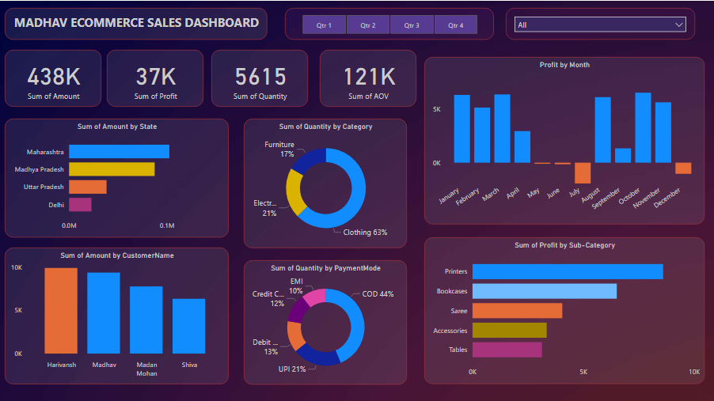

🛍️ Madhav Ecommerce Sales Dashboard

This project presents a visually interactive Sales Dashboard built for Madhav Ecommerce, aiming to provide key insights into sales performance, customer behavior, and profitability trends across different states, categories, and payment modes.

📊 Project Overview

The dashboard provides a comprehensive view of ecommerce sales data, helping stakeholders quickly identify:

  Total Sales Amount

  Total Profit

  Quantity Sold

  Average Order Value (AOV)

  State-wise and Customer-wise Contributions

  Category & Sub-category Performance

  Monthly Profit Trends

  Preferred Payment Modes

🔍 Key Features

  KPIs: High-level metrics including total sales, profit, quantity, and AOV.

  Filters: Quarterly and categorical filters for dynamic analysis.

  State-wise Sales: Visualized through a bar chart for regional performance.

  Customer Insights: Identifies top contributing customers.

  Category Breakdown: Donut charts for quantity by product category and payment mode distribution.

  Monthly Profit Trend: Highlights profit fluctuation over months with positive/negative margins.

  Sub-category Profitability: Compares profitability across key sub-categories.

🛠️ Tools & Technologies

  Microsoft Power BI 

  Data Visualization

📈 Business Insights

  Clothing dominates the sales quantity (63% share).

  Maharashtra leads in revenue generation.

  UPI and COD are the most preferred payment modes.

  July and September show significant profit dips—warranting deeper investigation.

  Printers and Bookcases are the most profitable sub-categories.

📁 Files

   Orders.csv
   
   Details.csv

  ### 🧭 Dashboard

The following dashboard presents key performance indicators and visual insights into Madhav Ecommerce's sales data.

✅ Recommendations

1)Investigate Negative Profit Months

  Conduct a detailed review of July and September transactions to identify causes for losses—such as returns, high discounts, or logistics costs.

2)Expand High-Performing Categories

  Products like Printers and Bookcases show strong profitability—consider increasing inventory or marketing efforts for these.

3)Target High-Converting States

  Maharashtra and Madhya Pradesh show high sales volume—run localized campaigns or optimize delivery networks in these regions.

4)Leverage Popular Payment Methods

  Since UPI and COD are preferred by most customers, ensure smooth transaction experiences and consider incentives for prepaid methods to reduce COD costs.

5)Customer Loyalty Program

  Introduce a loyalty program to reward top customers like Harivansh, encouraging repeat purchases and brand advocacy.

6)Push Clothing Sales with Bundles

  As Clothing is the highest in quantity sold, consider bundle offers or upsells to increase average order value and margin.

